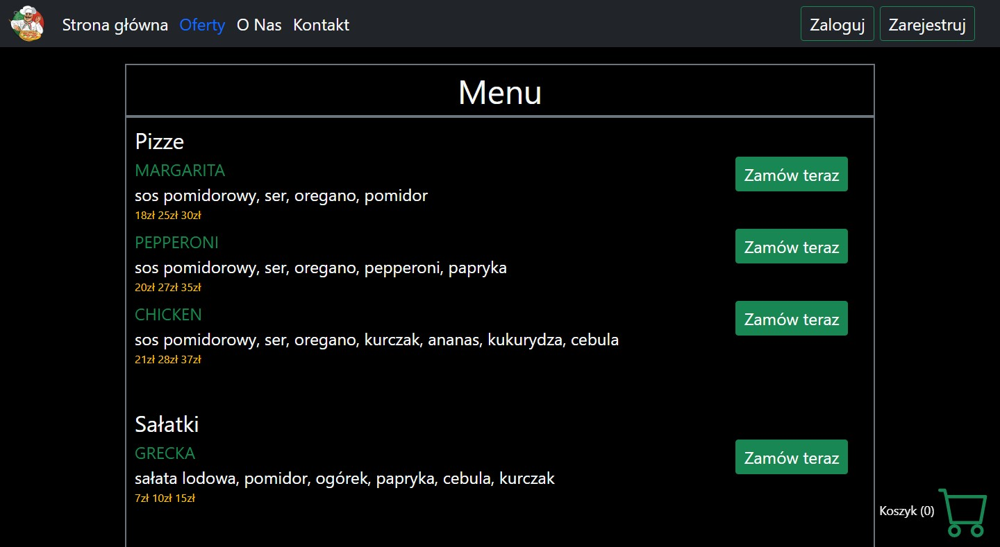
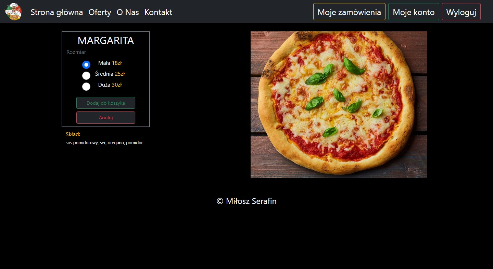
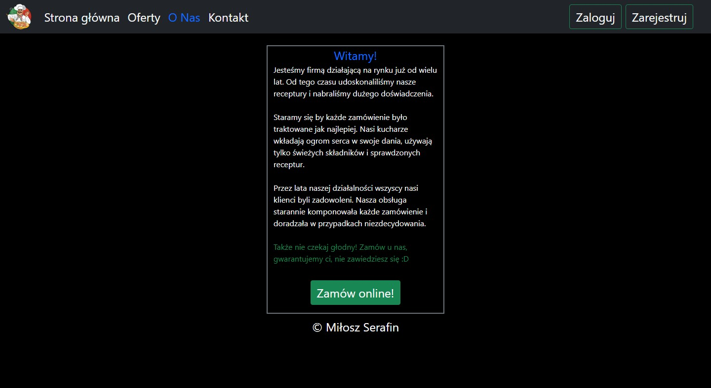
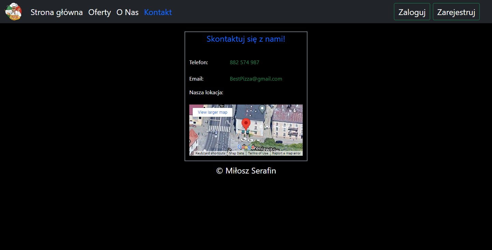
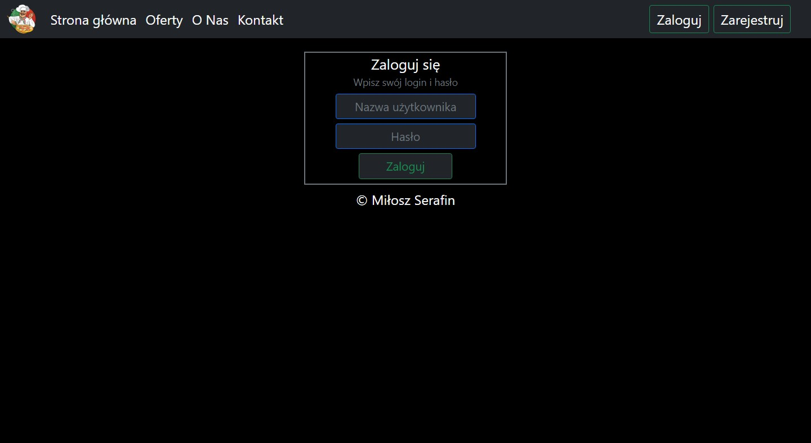
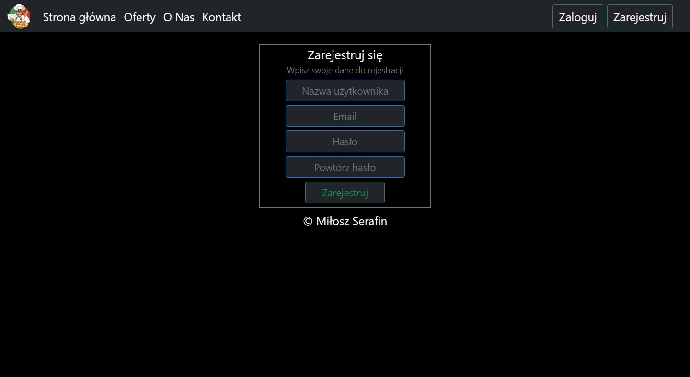
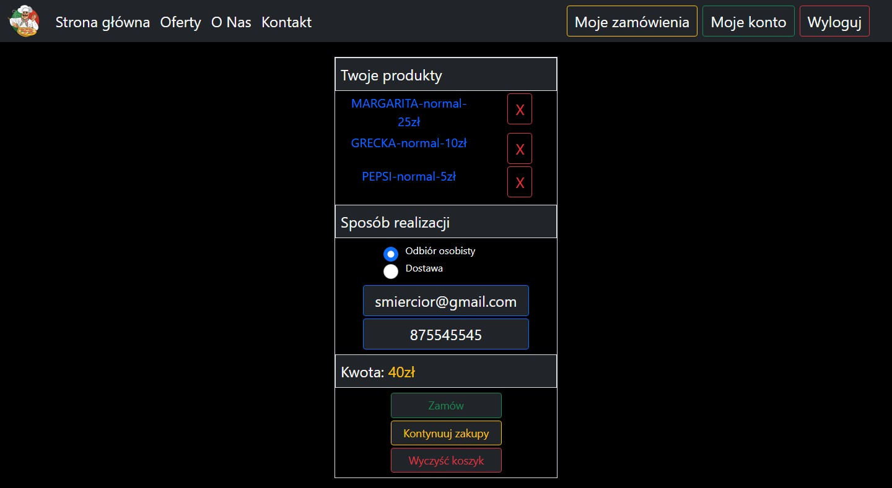
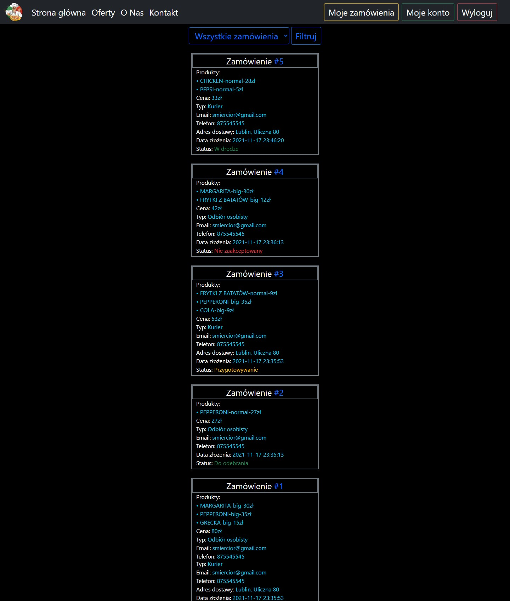
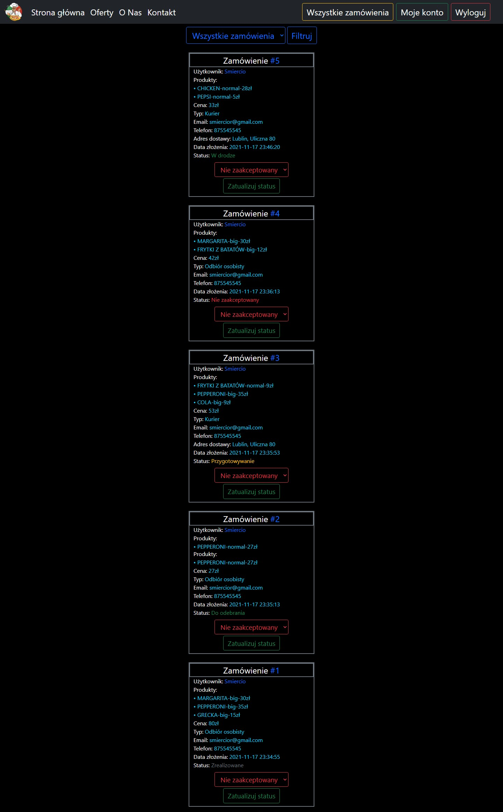
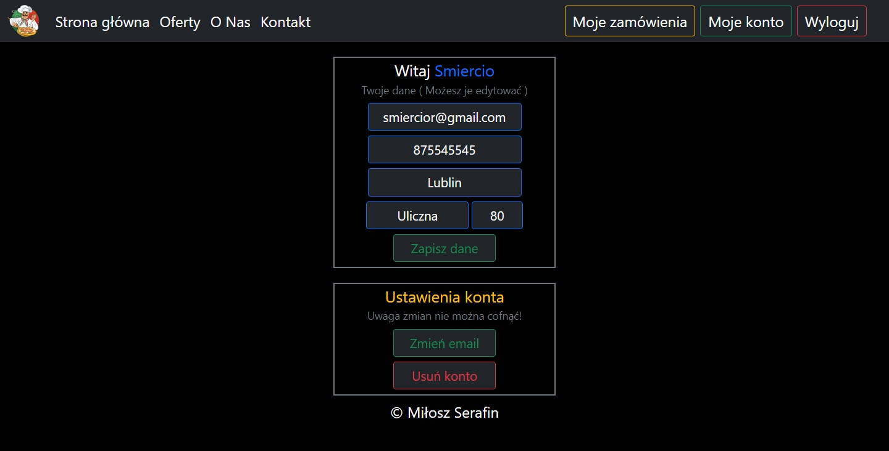

You must get PHPMailer-master from git : https://github.com/PHPMailer/PHPMailer/archive/master.zip
and put this folder in main directory

Change email password in app.ini to real password

Screenshots from site:
- index

- offers

- order

- about

- contact

- login

- register

- cart

- myOrders -> User

- myOrders -> Seller

- account
